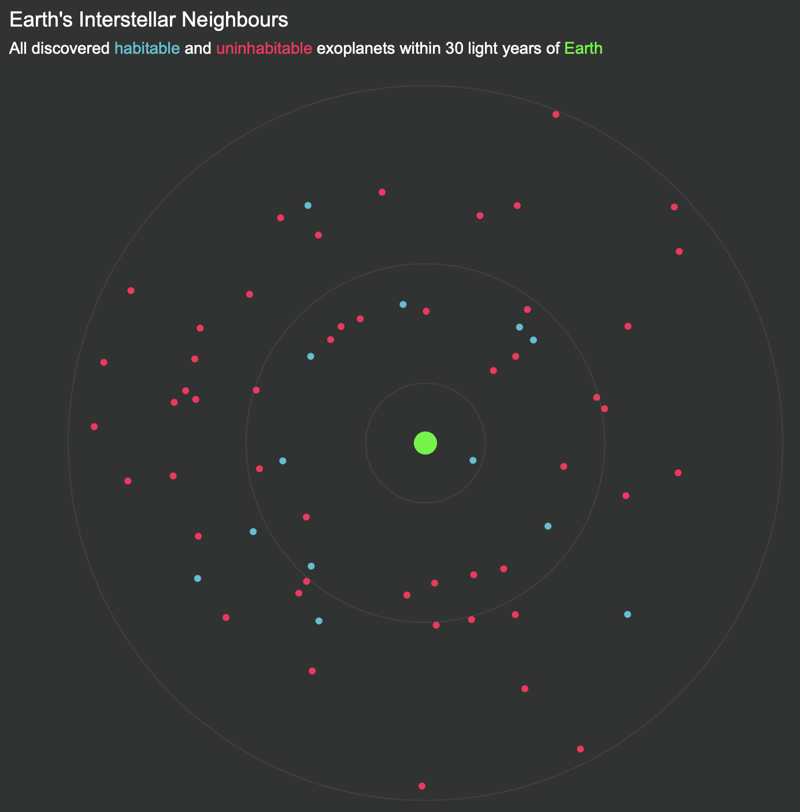

# Exoplanets
This is an interactive data story that takes the reader on a journey that helps them to identify the most exciting habitable exoplanets. The story then discusses the feasibility of interstellar missions.

All visualisations were created using the Python plotly API, and were combined using HTML and CSS. There is a separate .py file for each visualisation, and the final data story can be seen in the Website folder by opening index.html.

This piece of work was done as part of the COMP6234 Data Visualisation module at the University of Southampton. This data story achieved a mark of 100%.

